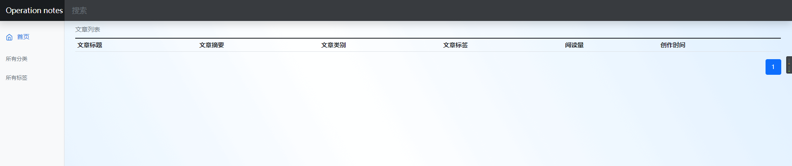
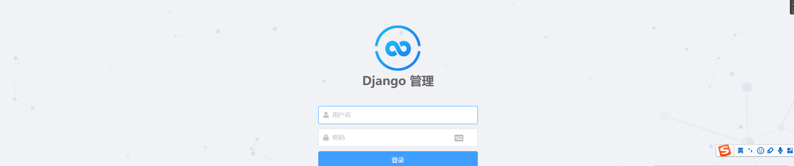

## 1. 克隆启动
```bash
git clone https://github.com/helmchars/notes.git
cd notes && docker-compose up -d
```


## 2. 进入容器，迁移数据，生成超级管理员
```bash
docker exec -it notes-dg  /bin/sh
python manage.py makemigrations
python manage.py migrate
python manage.py createsuperuser --username admin --email admin@qq.com
```


## 3. 重启docker-compose
```bash
docker-compose restart
```

## 4. 测试访问
```
http://ip:5000
```


## 5. 测试图


